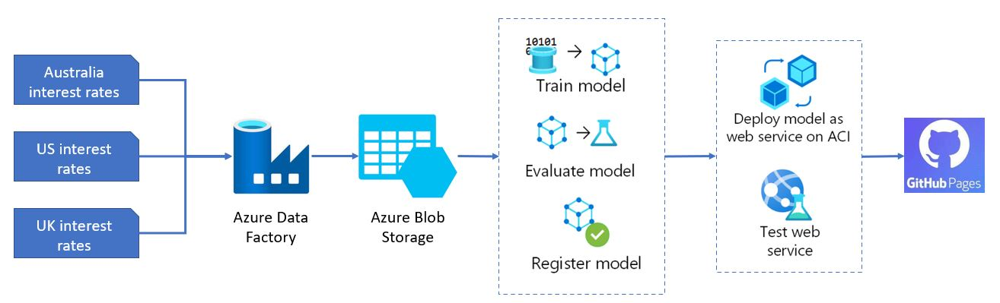

## Setup Environment
```
conda create --name creditrisk -c conda-forge python=3.9
conda activate creditrisk
conda install -c conda-forge mamba
mamba install -c conda-forge "pymc>=5.0.0" nutpie
mamba install -c conda-forge bokeh hvplot panel
pip install -r requirements.txt 
```


## Interest rate prediction


### Data sets
- US interest rate: https://fred.stlouisfed.org/series/FEDFUNDS
- UK interest rate: https://sdw.ecb.europa.eu/quickviewexport.do?SERIES_KEY=229.IRS.M.GB.L.L40.CI.0000.GBP.N.Z&type=csv
- AUS interest rate
    - From 2011: https://www.rba.gov.au/statistics/tables/xls/f01d.xls
    - Prev 2011: https://www.rba.gov.au/statistics/tables/xls-hist/f01dhist.xls

### Data pipelines and architecture



### Project dashboard
- Comming soon!